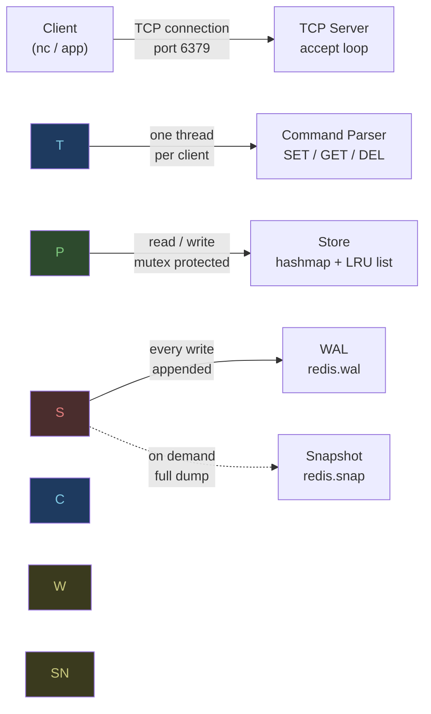
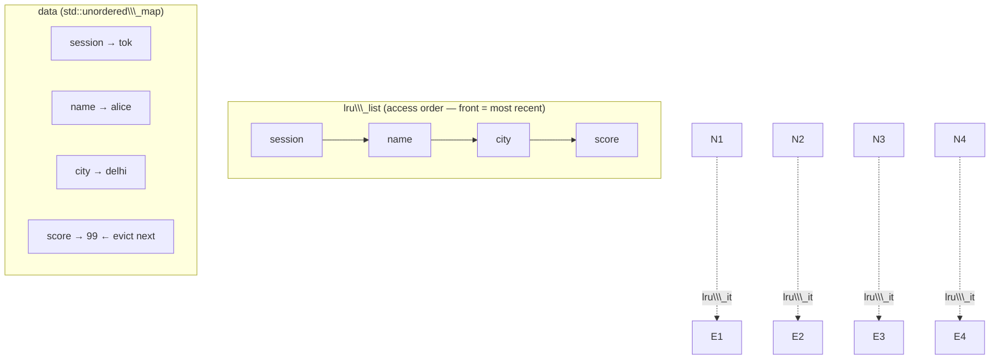
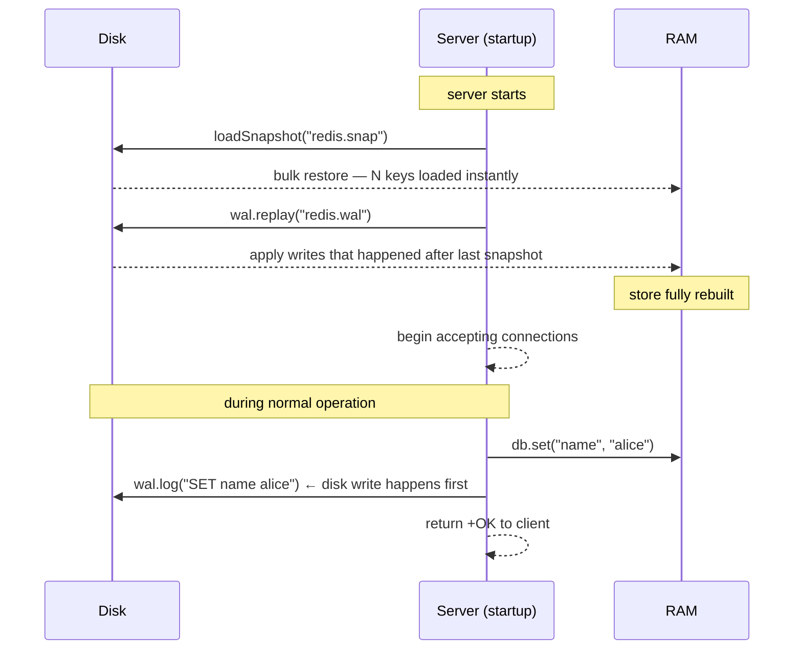

# redisClone

 
 


A lightweight, multithreaded key-value store written in C++ to practice core networking and data structures. Implements TCP networking, LRU eviction, TTL expiry, WAL-based crash recovery, and snapshot persistence — all from first principles.

I am using this project to apply my Data Structures and Algorithms (DSA) knowledge to a real-world system. It demonstrates how to handle multiple concurrent clients, manage memory efficiently, and implement custom data storage from the ground up.

---
## Architecture



Each client gets its own thread. All threads share one `Store` object
protected by a mutex. Every write goes to the WAL on disk before returning.
Snapshots compress the full store state so WAL replay on startup stays fast.

\---

## Features

* `SET / GET / DEL` with O(1) average lookup via `std::unordered\\\_map`
* TTL expiry — keys auto-delete after N seconds (lazy deletion, no background thread)
* LRU eviction — least recently used key evicted when store hits capacity
* Multithreaded — handles concurrent clients, mutex-protected shared state
* WAL persistence — every write logged to disk, replayed on startup
* Snapshot persistence — full state dump, combined with WAL for fast recovery

\---

## Build

Requires g++ with C++17. On Linux or WSL:

```bash
sudo apt install g++ build-essential
```

Compile the server:

```bash
g++ -std=c++17 store.cpp wal.cpp snapshot.cpp server.cpp -o mini-redis -lpthread
```

Compile the benchmark:

```bash
g++ -std=c++17 -O2 benchmark.cpp -o benchmark
```

\---

## Run

**Terminal 1 — start the server:**

```bash
./mini-redis
```

```
Loaded 0 keys from disk.
Mini Redis listening on port 6379...
```

**Terminal 2 — connect:**

```bash
nc localhost 6379
```

**Try it:**

```
PING
SET name alice
GET name
SET session tok EX 10
GET session
DEL name
GET name
DBSIZE
```

\---

## Supported Commands

|Command|Example|Response|Notes|
|-|-|-|-|
|`PING`|`PING`|`+PONG`|health check|
|`SET`|`SET name alice`|`+OK`|store a value|
|`SET EX`|`SET name alice EX 30`|`+OK`|expires in 30 seconds|
|`GET`|`GET name`|`$5\\\\r\\\\nalice`|nil if not found or expired|
|`DEL`|`DEL name`|`:1`|returns count deleted|
|`DBSIZE`|`DBSIZE`|`:3`|number of live keys|

\---

## How it works

### Storage — hashmap + LRU list

Every key maps to an `Entry` containing its value, expiry timestamp,
and an iterator pointing directly to its position in the LRU list.



Storing the iterator directly inside each entry is what makes LRU O(1).
Without it you'd have to scan the whole list to find the node — O(n) on
every single GET. With it: erase from current position, push to front,
update the stored iterator. Three operations, all constant time.

**TTL expiry** uses lazy deletion — there's no background thread waking
up to scan for expired keys. A key's expiry is checked when someone tries
to read it. If it's past, delete it and return nil. Simpler than running
a separate cleaner, and a background cleaner would need its own locking
anyway.

\---

### Persistence — WAL + Snapshots



**Why both WAL and snapshots?**

WAL alone means replaying every write since the beginning of time on every
restart. After a week of traffic that's potentially millions of lines. Snapshots
solve this — they're a full dump of the store at a point in time. Recovery
becomes: load snapshot (fast, one bulk read) then replay only the short WAL
written since that snapshot (small).

Recovery order matters. Snapshot loads first, WAL applies on top. WAL entries
are always newer so they win on conflict.

\---

### Concurrency

One mutex protects the entire `Store`. Every `set()`, `get()`, and `del()`
acquires it before touching `data` or `lru\\\_list`.

```
Thread A (client 1)          Thread B (client 2)
─────────────────────        ─────────────────────
recv: "SET name bob"         recv: "SET name charlie"
lock\\\_guard acquires mtx  →   waiting for mtx...
  data\\\["name"] = "bob"
  lru\\\_list updated
lock released            →   lock\\\_guard acquires mtx
                               data\\\["name"] = "charlie"
                               lru\\\_list updated
                             lock released
```

Without the mutex, both threads can read `lru\\\_list` state at the same time,
both modify it, and corrupt the internal pointers. Hit this exact segfault
during benchmarking when multiple clients were hammering SETs concurrently.
Every path through the store now holds the lock before touching anything.

\---

## Performance

### Benchmark results (WSL2, Ubuntu on Windows)

```bash
./benchmark   # run with server already up in another terminal
```

```
Benchmarking mini-redis (100000 ops each)

SET:  20,428 req/sec  (0.049ms avg)
GET:  26,041 req/sec  (0.038ms avg)
PING: 27,129 req/sec  (0.037ms avg)
```

\---

### How these numbers changed over time

These weren't the first numbers out of the gate. Two decisions shifted
things noticeably.

#### WAL flush strategy

The first version called `out\\\_.flush()` after every write. That forces the
OS to flush its internal buffer to disk immediately — safe but expensive.
Disk I/O on every single SET was killing throughput.

```
SET throughput — before and after batching flushes
──────────────────────────────────────────────────────────────────
flush every write   ██░░░░░░░░░░░░░░░░░░░░░░░░░░░░░░   2,468 req/sec
flush every 100     ████████████████████████████████░  20,428 req/sec
                                                        8.3x faster

GET was unaffected both times — GET never touches disk.
```

Batching flushes every 100 writes means you could lose up to 100 writes
on a hard crash. That's a real tradeoff — durability vs throughput. Production
databases expose this as a tunable config. Here, every-100 is good enough.

#### TCP\_NODELAY experiment

Tried disabling Nagle's algorithm expecting a speedup. Numbers got slightly
worse. Reverted.

```
With TCP\\\_NODELAY:     SET 20,258  GET 22,581  PING 21,084
Without TCP\\\_NODELAY:  SET 20,428  GET 26,041  PING 27,129
```

Nagle's algorithm batches small packets before sending — on a real network
it adds latency waiting to fill a packet, so disabling it helps. But on
localhost there's no real network, data moves through the kernel directly.
Nagle's batching actually reduces context switches in that case. Disabling
it added overhead instead of removing it. Environment matters.

\---

### Why WSL2 numbers are lower than native Linux

The same code on native Linux would likely hit **60,000 – 100,000 req/sec**.
The gap has nothing to do with the code — it's the virtualization layer.

```
Native Linux — what happens on localhost
──────────────────────────────────────────────────
  client process
       │  send()
       ▼
  Linux kernel — loopback interface (lo)
       │  direct memory copy, no hardware involved
       ▼
  server process
       │  recv()
       └─ handleCommand()

Latency: microseconds. Pure in-kernel operation.


WSL2 — what happens on localhost
──────────────────────────────────────────────────
  client process (inside Hyper-V VM)
       │  send()
       ▼
  WSL2 Linux kernel (running inside Hyper-V VM)
       │
       ▼
  Hyper-V virtual network adapter  ← VM boundary crossed here
       │  context switch: VM → Windows host
       ▼
  Windows host network stack
       │  context switch: Windows → VM
       ▼
  Hyper-V virtual network adapter (receive side)
       │
       ▼
  WSL2 Linux kernel (receive side)
       │
       ▼
  server process
       │  recv()
       └─ handleCommand()

Latency: higher. Every send/recv crosses the VM boundary twice.
```

WSL2 runs Linux inside a Hyper-V VM. Even for localhost traffic that
never physically leaves the machine, the WSL2 network stack is virtualised
so every packet crosses this boundary. On native Linux, loopback is a
direct kernel memory operation — no VM, no virtual adapter, no context
switches to the host OS.

```
Expected numbers for this implementation, same hardware
──────────────────────────────────────────────────────────
                    WSL2          Native Linux (estimated)
mini-redis SET      \\\~20k          \\\~65-80k req/sec
mini-redis GET      \\\~26k          \\\~80-100k req/sec
```

The remaining gap on native Linux between this implementation and a
production-grade store comes down to the global mutex — every operation
serialises. The fix is per-shard locking: split the keyspace into N
independent maps each with their own lock, reducing contention by N.

\---

## Tradeoffs

|Decision|What I chose|Alternative|Why|
|-|-|-|-|
|**Locking**|Single global mutex|Per-shard locking|Simpler and correct. Sharding reduces contention but every operation needs to know which shard to lock — adds complexity I didn't need yet|
|**WAL flush**|Every 100 writes|Every write|Every-write is 8x slower, measured. Every-100 is a reasonable middle ground — worst case lose 100 writes on a crash|
|**Thread model**|One thread per client|Fixed thread pool|One-per-client is readable and simple. Thread pool is better under load but unbounded spawning would fall over at thousands of connections|
|**TTL expiry**|Lazy deletion on read|Background sweeper thread|No extra thread, no extra locking. Expired keys sit in RAM until read — acceptable at this scale|
|**Eviction**|LRU|LFU / FIFO|LRU is a good approximation of real access patterns. LFU is more accurate but needs per-key frequency counters which adds memory overhead|
|**Snapshot trigger**|Manual / on-demand|Background thread every 60s|Background thread caused a segfault — was copying `Entry` objects with live iterators across threads. Needs a proper fix before re-enabling|
|**Protocol**|Plain text, one command per line|Full RESP wire protocol|RESP compliance would mean any standard client library works out of the box. Plain text is much easier to debug with nc|

\---

## Known limitations

**Unbounded threads** — one OS thread spawned per client connection.
Works fine at low concurrency, falls over at thousands. Proper fix is a
fixed thread pool where N workers pull from a shared queue of incoming fds.

**Global mutex** — everything serialises at the store level. Under high
concurrent load all threads pile up waiting for the lock. Shard the
keyspace into N independent maps to fix this.

**No background snapshots** — the background snapshot thread was removed
after it caused a segfault. The issue was copying `Entry` structs (which
contain live `lru\\\_list` iterators) across threads. The safe `SnapEntry`
copy already exists, just needs the background thread rewritten to use it.

**Plain text protocol** — close to RESP format but not compliant. Standard
client libraries won't connect. Implementing full RESP is a few hundred
lines and would make the whole thing interoperable with existing tooling.

**Missing commands** — `KEYS`, `EXISTS`, `EXPIRE`, `TTL`, `INCR`, `MSET`,
`MGET` aren't there. Each one is a few lines once the core infrastructure
is in place.

\---

## Concepts covered

|Subject|Where it shows up|
|-|-|
|**OS**|threads, mutexes, file I/O, process memory|
|**Networking**|TCP sockets, BSD socket API, loopback interface, connection lifecycle|
|**Databases**|WAL, crash recovery, snapshotting, TTL, eviction policies|
|**DSA**|hashmap internals, doubly linked list, LRU in O(1)|
|**Systems**|benchmarking, bottleneck identification, tradeoff analysis|

\---

## Project structure

```
store.h / store.cpp          in-memory store, LRU eviction, TTL expiry
wal.h / wal.cpp              write-ahead log, append on write, replay on startup
snapshot.h / snapshot.cpp    full state dumps to and from disk
server.cpp                   TCP server, command parsing, client threads
benchmark.cpp                throughput and latency measurement
```

